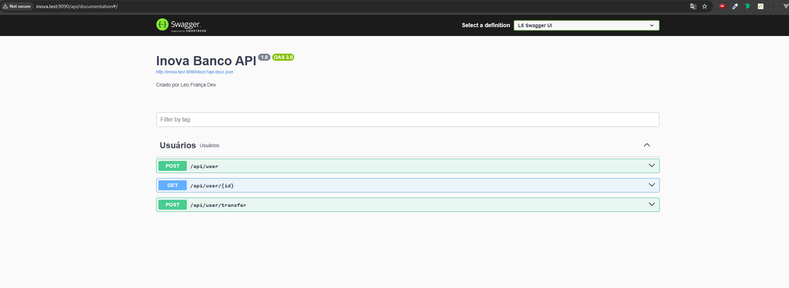

## INOVA BANCO
### Executando o Projeto
* Para copiar o .env.example para o .env e execute o comando `cp .env.example .env`
* Para executar o projeto, basta executar o comando `docker compose up -d`
* Execute o comando `docker compose exec inova composer install`
* Para criar as tabelas da api execute o comando `docker compose exec inova php artisan migrate`
* Para adicionar os tipos de usuários execute o comando `docker compose exec inova php artisan db:seed`
* Foi configurado o endereço `inova.test` adicione no arquivo `hosts` apontando para o ip `127.0.0.1`
* Para acessar o projeto acesse o endereço `inova.test:9090`
* Para Acessar a documentação da api e executar via swagger acesse o endereço `http://inova.test:9090/api/documentation`
* Caso gere erro de permissão na pasta storage, execute o comando `docker compose exec inova chmod -R 777 storage/`

### Como foi desenvolvido a api
* Foi Utilizado o framework Laravel na última versão até o momento 12 (06/04/2025), para o banco de dados foi escolhido o MYSQL
* Utilizei a tecnica de TDD, criando os testes antes de desevolver as classes, dessa forma facilita chegar no objetivo esperado
* Utilizei o padrao de arquitetura REST para desenvolver a api

